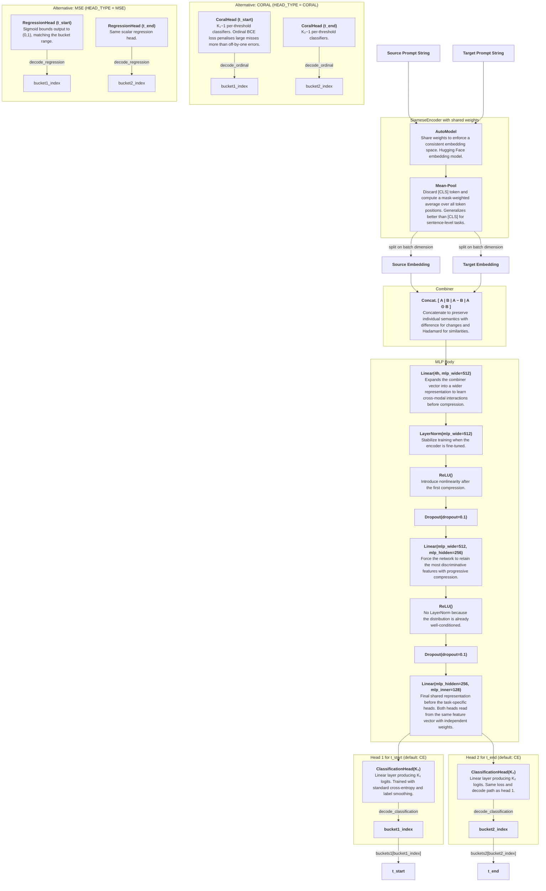

# Classification Model Design

## Task

Given a `(source_prompt, target_prompt)` string pair, predict two diffusion timestep parameters $t^*$ and $t^{**}$, referred to in code as `t_start` and `t_end`.

## Architecture

The diagram below shows the default CE path connected to the shared encoder and MLP body. CORAL and MSE are alternative head implementations selected at construction time via `HEAD_TYPE`; they replace the CE heads but are not part of the default forward path.



Strings `source_prompt` and `target_prompt` are fed into `SiameseEncoder` which outputs the concatenated embedded vector $\langle A \mid B \mid A - B \mid A \odot B \rangle$ where $\odot$ is the Hadamard product, element-wise multiplication. This output vector has size $4 \times 384 = 1536$.

The $1536$-dimensional vector is passed through an MLP body of `Linear` with $1536 \rightarrow 512$, `LayerNorm`, `ReLU`, `Dropout` with $0.1$, `Linear` with $512 \rightarrow 256$, `ReLU`, `Dropout` with $0.1$, and `Linear` with $256 \rightarrow 128$. The $128$-dimensional output is then routed to two parallel heads with `head1` for `t_start` and `head2` for `t_end`.

`HEAD_TYPE` selects which head implementation is wired in at construction time. The default is `"CE"`: each head outputs $K_i$ logits, training minimises cross-entropy against one-hot bucket labels (with optional label smoothing), and inference takes the argmax class. Alternative types are `CORAL` (ordinal thresholds) and `MSE` (scalar regression snapped to the nearest bucket). Each decoded index lies in $\{0, \dots, k_i-1\}$ and maps to a float value in $[0.0, 1.0]$ via the ordered `buckets1` / `buckets2` tensors.

### Encoder: `SiameseEncoder`

Uses `sentence-transformers/all-MiniLM-L6-v2` that outputs a hidden dimension of $384$. Both strings are encoded with *shared weights* in a single-batched forward pass. Token embeddings are reduced to a fixed-size sentence vector via mask-weighted mean pooling, which is more robust than the `[CLS]` token for sentence-level tasks.

The encoder is fine-tuned by default (`FREEZE_ENCODER = False`). When the encoder is frozen, only the MLP and heads learn. When fine-tuning is enabled, the optimizer assigns a lower learning rate to the encoder ($2 \times 10^{-5}$) than to the MLP ($10^{-3}$) to avoid destabilising the pretrained representations early in training.

### Combiner: `OrdinalPairClassifier._combine`

The four-part interaction vector $\langle A \mid B \mid A - B \mid A \odot B \rangle$ captures individual semantics for each prompt, direction and magnitude of the edit (differences between the prompts), and element-wise co-activation (similarities between the prompts).

### Classification Output Heads (default): `ClassificationHead`

Each head is a single `Linear(in_features, K)` layer producing $K$ raw logits per sample, where $K$ is the number of distinct bucket values for that target. Training uses `one_hot_ce_loss` (standard cross-entropy with optional `LABEL_SMOOTHING` and optional inverse-frequency class weights). Decoding picks the highest-logit class:

$$\hat{k} = \arg\max_j \; \text{logit}_j$$

`decode_head_pair` in `model.py` centralises the CORAL / CE / MSE decode paths and raises on unknown `head_type` values.

### Ordinal Output Heads (alternative): `CoralHead`

When `HEAD_TYPE = "CORAL"`, each head uses the CORAL (Consistent RAnk Logits) formulation from [Cao et al. 2020](https://arxiv.org/abs/1901.07884). The head maintains $k_i-1$ independent per-threshold weight vectors:

$$\text{logit}_j = w_j^\top x + b_j, \quad j = 0, \ldots, k_i-2$$

The ordinal structure is enforced entirely through the loss function rather than architectural weight sharing. Decoding counts how many thresholds are exceeded (`logit > 0`), giving a bucket index $[0, k_i-1]$. The ordinal encoding assigns each class a prefix of 1s:

```
Class 0: [0, 0, ..., 0, 0]
Class 1: [1, 0, ..., 0, 0]
...
Class k_i-2: [1, 1, ..., 1, 0]
Class k_i-1: [1, 1, ..., 1, 1]
```

Training uses binary cross-entropy over these threshold targets. Biases are initialised as `linspace(2, −2)` so that implied class probabilities are spread across the full range from the first training step.

### Regression Output Heads (alternative): `RegressionHead`

When `HEAD_TYPE = "MSE"`, each head is a single `Linear` layer with a sigmoid activation, producing one scalar per sample in $(0, 1)$:

$$\hat{y} = \sigma\!\left(w^\top x + b\right)$$

At inference, the continuous prediction is snapped to the nearest bucket index. Training minimises mean-squared error between the predicted scalar and the true bucket float value.

## Data Pipeline

1. Load `id_to_metrics_*.csv` and filter to rows where `t_delta == T_DELTA_TARGET`
2. Compute the configured target score (default: `naive_pareto_score`) and pick the row with the highest score per `sample_id`
3. Join with `id_to_string_pair.csv` to get `(source_prompt, target_prompt)`
4. Map discrete `t_start` / `t_end` float values to ordinal indices $0, 1, 2, \ldots$ using the sorted levels from the full (unfiltered) metrics CSV
5. Random split 80/10/10 for train/val/test

### Target Score Options

The score used to select the best row per `sample_id` is configurable in `settings.py` via `TARGET_METRIC`.

- **`weighted_combined_score`**: $\lambda_{\text{PSNR}} \cdot \hat{p} + \lambda_{\text{CLIP}} \cdot \hat{c}$, where $\hat{p}$ and $\hat{c}$ are min-max normalised PSNR and CLIP similarity, with $\lambda_{\text{PSNR}} = \lambda_{\text{CLIP}} = 0.5$ by default.

- **`agreement_score`**: $1 - \lvert p - c \rvert \,/\, \max(\lvert p - c \rvert)$, measuring how closely PSNR and CLIP agree on raw values.

- **`naive_pareto_score`** (active default): For each `sample_id` group, the baseline row is identified at $t_{\text{start}} = \text{PAPER\_T\_START} - \text{PAPER\_T\_DELTA}$, $t_{\text{end}} = \text{PAPER\_T\_END}$ (defaults $(0.75, 0.3)$). Each row receives score $\max(0, \Delta\text{PSNR}) \cdot \max(0, \Delta\text{CLIP})$ relative to that baseline; the baseline itself scores $0$.

- **`pareto_biased_score`**: Uses the same baseline as `naive_pareto_score`. With $s(t) = \operatorname{softplus}(t) - \log 2$, each row receives $m(a,b) = s(a-A) + s(b-B) + \alpha\, s(a-A)\, s(b-B)$ where $a$, $b$ are PSNR and CLIP and $A$, $B$ are the baseline values. Default $\alpha = 2$ (`_PARETO_BIAS_ALPHA` in `settings.py`). The baseline scores $0$; improvements are rewarded smoothly and regressions penalised.

## Training

| Hyperparameter | Value |
|---|---|
| Encoder | `all-MiniLM-L6-v2` (fine-tuned by default) |
| Head type | `CE` (default), `CORAL`, or `MSE` |
| CE loss | Standard cross-entropy with `LABEL_SMOOTHING = 0.1` |
| Optimizer | AdamW with `WEIGHT_DECAY = 0.01`; encoder lr $= 2 \times 10^{-5}$, MLP lr $= 10^{-3}$ |
| Epochs | $20$ |
| Batch size | $32$ |
| Dropout | $0.1$ |
| Class weights | Off by default (`USE_CLASS_WEIGHTS = False`) |
| Checkpoint | Best model by validation balanced accuracy on `t_start` |
