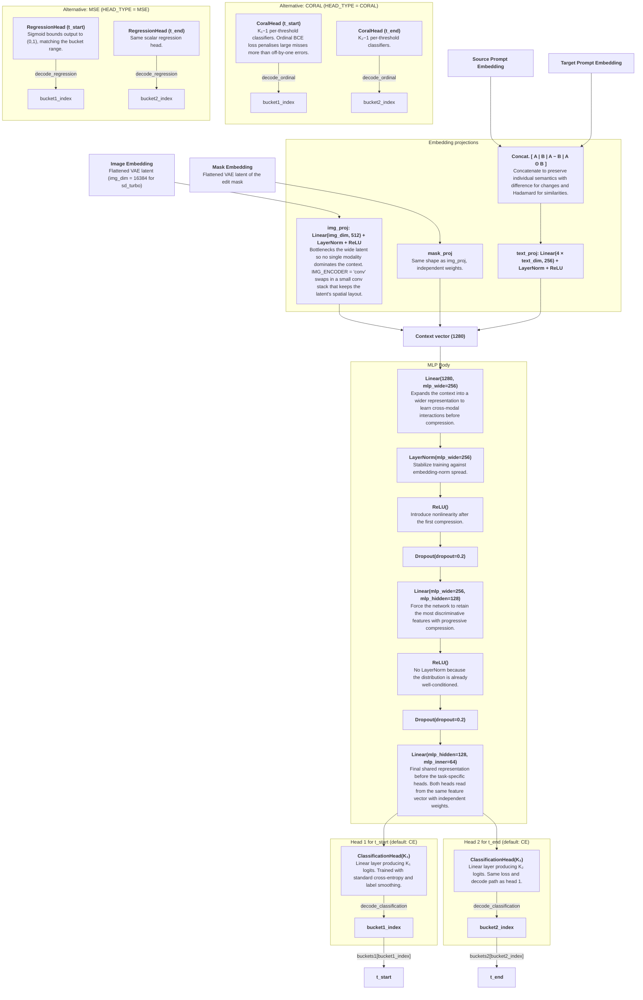

# Classification Model Design

## Task

Given a sample's source image, edit mask, and `(source_prompt, target_prompt)` string pair — all as precomputed ChordEdit embeddings — predict two diffusion timestep parameters $t^*$ and $t^{**}$, referred to in code as `t_start` and `t_end`.

## Architecture

The diagram below shows the default CE path connected to the embedding projections and MLP body. CORAL and MSE are alternative head implementations selected at construction time via `HEAD_TYPE`; they replace the CE heads but are not part of the default forward path.



The four embeddings enter through per-modality projections mirroring the modified model's `SurrogateRegressor` input side: `img_proj` and `mask_proj` bottleneck the flattened VAE latents to `IMG_PROJ_DIM = 512` each, and `text_proj` compresses the combined text vector $\langle A \mid B \mid A - B \mid A \odot B \rangle$ (where $\odot$ is the Hadamard product) to `TEXT_PROJ_DIM = 256`.

The concatenated $1280$-dimensional context vector is passed through an MLP body of `Linear` with $1280 \rightarrow 256$, `LayerNorm`, `ReLU`, `Dropout` with $0.2$, `Linear` with $256 \rightarrow 128$, `ReLU`, `Dropout` with $0.2$, and `Linear` with $128 \rightarrow 64$. The $64$-dimensional output is then routed to two parallel heads with `head1` for `t_start` and `head2` for `t_end`.

`HEAD_TYPE` selects which head implementation is wired in at construction time. The default is `"CE"`: each head outputs $K_i$ logits, training minimises cross-entropy against one-hot bucket labels (with optional label smoothing), and inference takes the argmax class. Alternative types are `CORAL` (ordinal thresholds) and `MSE` (scalar regression snapped to the nearest bucket). Each decoded index lies in $\{0, \dots, k_i-1\}$ and maps to a float value in $[0.0, 1.0]$ via the ordered `buckets1` / `buckets2` tensors.

### Embeddings: `embeddings.py`

The model never runs an encoder itself: it consumes embeddings produced by the same frozen ChordEdit VAE and text encoder that generated the metric labels, so the classifier's inputs stay consistent with the runs that produced `(psnr, clip)`. Image and mask embeddings are flattened VAE latents; text embeddings are pooled per prompt (mask-weighted mean over `last_hidden_state` for SD, `text_encoder_2` pooled embeds for SDXL).

`embeddings.get_embeddings` serves them from a three-tier cache:

1. **Packed table** at `.cache/packed_embeddings/<CHORD_EDIT_MODEL>-<t_delta>-<dir_slug>.pt` — one stacked tensor per modality, tagged with a `meta` dict (model, text pooling, image size, crop, dir, `t_delta`). Any mismatch with the current settings is treated as a miss and repacked.
2. **Scattered per-sample `.pt` files** under `EMBEDDINGS_DIR`, indexed by `EMBEDDINGS_CSV` — written by the annotation pipeline; packed into tier 1 on first use.
3. **Live encoding** — only if a predictor object with `image_encoder` / `text_encoder` is passed. The classifier passes `predictor=None`, so a full cache miss raises with instructions instead of silently loading the diffusion pipeline.

### Combiner: `model.combine_text_embeddings`

The four-part interaction vector $\langle A \mid B \mid A - B \mid A \odot B \rangle$ captures individual semantics for each prompt, direction and magnitude of the edit (differences between the prompts), and element-wise co-activation (similarities between the prompts).

### Classification Output Heads (default): `ClassificationHead`

Each head is a single `Linear(in_features, K)` layer producing $K$ raw logits per sample, where $K$ is the number of distinct bucket values for that target. Training uses `one_hot_ce_loss` (standard cross-entropy with optional `LABEL_SMOOTHING` and optional inverse-frequency class weights). Decoding picks the highest-logit class:

$$\hat{k} = \arg\max_j \; \text{logit}_j$$

`decode_head_pair` in `model.py` centralises the CORAL / CE / MSE decode paths and raises on unknown `head_type` values.

### Ordinal Output Heads (alternative): `CoralHead`

When `HEAD_TYPE = "CORAL"`, each head uses the CORAL (Consistent RAnk Logits) formulation from [Cao et al. 2020](https://arxiv.org/abs/1901.07884). The head maintains $k_i-1$ independent per-threshold weight vectors:

$$\text{logit}_j = w_j^\top x + b_j, \quad j = 0, \ldots, k_i-2$$

The ordinal structure is enforced entirely through the loss function rather than architectural weight sharing. Decoding counts how many thresholds are exceeded (`logit > 0`), giving a bucket index $[0, k_i-1]$. The ordinal encoding assigns each class a prefix of 1s:

```
Class 0: [0, 0, ..., 0, 0]
Class 1: [1, 0, ..., 0, 0]
...
Class k_i-2: [1, 1, ..., 1, 0]
Class k_i-1: [1, 1, ..., 1, 1]
```

Training uses binary cross-entropy over these threshold targets. Biases are initialised as `linspace(2, −2)` so that implied class probabilities are spread across the full range from the first training step.

### Regression Output Heads (alternative): `RegressionHead`

When `HEAD_TYPE = "MSE"`, each head is a single `Linear` layer with a sigmoid activation, producing one scalar per sample in $(0, 1)$:

$$\hat{y} = \sigma\!\left(w^\top x + b\right)$$

At inference, the continuous prediction is snapped to the nearest bucket index. Training minimises mean-squared error between the predicted scalar and the true bucket float value.

## Data Pipeline

1. `_data.load_df` loads `id_to_metrics_*.csv` (`METRICS_CSV`), drops rows missing the `C_TARGET_COLS` metrics, zero-pads `sample_id` to the canonical 8-digit form, and filters to rows where `t_delta == TARGET_T_DELTA`; it then loads `id_to_inputs_*.csv` (`INPUTS_CSV`), backfills `mask_image_path` from `downloaded_mask_image_path`, drops maskless rows, resolves relative image/mask paths against `DATASET_DIR`, and left-merges prompts and paths onto the metrics — one row per grid cell
2. `_data.select_best_rows` computes the configured target score via `C_TARGET_FUNC` on the full cell table when the CSV does not already carry `C_TARGET_COL` (the per-sample delta normalization needs every cell), and picks the row with the highest `C_TARGET_COL` per `sample_id`. The baseline row scores exactly $0$, so the selected row is the best improvement over the baseline edit, or the baseline itself when no candidate improves on it
3. Discrete `t_start` / `t_end` float values are mapped to ordinal indices $0, 1, 2, \ldots$ into the fixed grids `GRID_T_START` / `GRID_T_END` (missing cells in the CSV are fine; those classes simply receive no labels)
4. `_data.split_df` splits by unique `sample_id` with a seeded permutation into `TRAIN_FRAC` / `VAL_FRAC` / `TEST_FRAC` (default 80/10/10), guaranteeing a nonempty test split; training saves the membership to `<run_dir>/id_to_split.csv` and `_data.load_split_df` replays it for evaluation
5. `_data.create_sample_tensors` materializes the four embeddings for all splits with a single `embeddings.get_embeddings` call and builds device-resident `SampleTensors` (embeddings plus `y1` / `y2` bucket-index labels), which `iter_batches` slices during training

Each run directory also holds the exact `settings.json` the run used (`_helpers.save_run_settings`); `_helpers.load_run_settings` binds the settings module to that snapshot before `_data` / `model` are imported, so evaluation reproduces the training config.

### Target Score Options

The score used to select the best row per `sample_id` is configured in `settings.json` via `C_TARGET_FN` (`"naive"` | `"cara"` | `"linex"`) and `C_TARGET_ALPHA`. `C_TARGET_COLS` names the raw metric columns passed into the score function (default: PSNR and CLIP); `C_TARGET_COL` is derived as `f"{C_TARGET_FN}_score"`.

Metrics live on different scales, so scoring never uses raw values. For each `sample_id`, `scores.calc_normalized_deltas` min-max scales each metric across that sample's candidate cells $T$ and subtracts the baseline cell $s_i^0$ at $(\text{DEFAULT\_T\_START}, \text{DEFAULT\_T\_END})$:

$$\Delta_i = \frac{s_i - s_i^0}{\max_T s_i - \min_T s_i}$$

giving $\Delta_i \in [-1, 1]$, with $\Delta_i > 0$ an improvement and $\Delta = 0$ at the baseline. `scores.score_df` performs the DataFrame $\to (B, N, C)$ packing, applies the score in one batched call, and returns a `pd.Series` aligned to `df.index`. All scores are plain functions of $\Delta$ and are differentiable, so the same objective can be reused as a training signal without change.

- **`naive_score`**: $\varphi(\Delta) = \sum_i w_i \Delta_i$. Simple and interpretable, each weight independently scaling one metric's importance. Indifferent to balance: it cannot distinguish a candidate that improves both metrics moderately from one that maximizes one while tanking the other, so long as the weighted sums match.

- **`cara_score`**: $\varphi(\Delta) = \frac{1}{\alpha}\sum_i w_i\left(1 - e^{-\alpha\Delta_i}\right)$, the exponential (CARA) utility $u(x) = (1 - e^{-\alpha x})/\alpha$ normalized so $u(0) = 0$ and $u'(0) = 1$. Strict concavity biases toward balance: regressions incur an exponentially growing penalty. The cost is that gains saturate at $w_i/\alpha$, so it cannot separate "improves a metric strongly" from "improves it very strongly".

- **`linex_score`** (active default): the average of the two, i.e. the linear-exponential (LINEX) utility $u(x) = \tfrac{1}{2}\left(x + (1 - e^{-\alpha x})/\alpha\right)$:

$$\varphi_{\text{LINEX}}(\Delta) = \frac{1}{2}\sum_i w_i\left[\Delta_i + \frac{1 - e^{-\alpha\Delta_i}}{\alpha}\right]$$

  Keeps CARA's superlinear regression penalty while removing its reward cap — gains accrue at an asymptotic rate of $1/2$ per unit, so the score is unbounded in both directions. The trade-off is a weaker balance bias: at matched $\alpha$ its curvature is half of CARA's ($u''(0) = -\alpha/2$ vs $-\alpha$). Default $\alpha = 2$ (`C_TARGET_ALPHA`). Recovers `naive_score` as $\alpha \to 0^+$.

All three reduce the trailing metric axis of a $(\dots, N, C)$ delta tensor, accept optional per-metric `weights` of shape $(C,)$, and map $\Delta = 0 \mapsto 0$.

## Training

| Hyperparameter | Value |
|---|---|
| Inputs | Precomputed ChordEdit embeddings (image, mask, source prompt, target prompt); encoders never loaded during training |
| Head type | `CE` (default), `CORAL`, or `MSE` |
| CE loss | Standard cross-entropy with `LABEL_SMOOTHING = 0.15` |
| Optimizer | AdamW with `LR` $= 10^{-4}$, `WEIGHT_DECAY = 0.05` |
| Epochs | $20$ |
| Batch size | $64$ |
| Dropout | $0.2$ |
| Class weights | On by default (`USE_CLASS_WEIGHTS = True`) |
| Checkpoint | Best model by validation balanced accuracy on `t_start`; stores `img_dim` / `text_dim` / buckets / the run's config for reconstruction |
