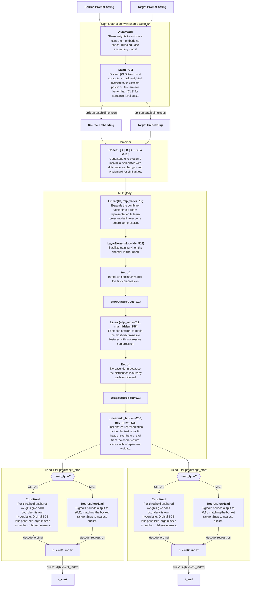

# Classification Model Design

## Task

Given a `(source_prompt, target_prompt)` string pair, predict two diffusion timestep parameters $t^*$ and $t^{**}$, refereed to in code as `t_start` and `t_end`.

## Architecture



Strings `source_prompt` and `target_prompt` are fed into `SiameseEncoder` which outputs the concatenated embeded vector $\langle A \mid B \mid A - B \mid A \odot B \rangle$ where $\odot$ is the Hadamard product, element-wise multuplication. This output vector has size $4 \times 384 = 1536$.

The $1536$-dimensional vector is passed through an MLP body of `Linear` with $1536 \rightarrow 512$, `LayerNorm`, `ReLU`, `Dropout` with $0.1$, `Linear` with $512 \rightarrow 256$, `ReLU`, `Dropout` with $0.1$, and `Linear` with $256 \rightarrow 128$. The $128$-dimensional output is then routed to two parallel heads with `head1` for `t_start` and `head2` for `t_end`. The head type is configurable: `CORAL` for ordinal threshold classification or `MSE` for scalar regression. Each head's output is decoded to a bucket index in $\{0, \dots, k_i-1\}$ where $k_i$ is the number of distinct bins for $t_i$, which maps to a float value in $[0.0, 1.0]$.

### Encoder: `SiameseEncoder`

Uses `sentence-transformers/all-MiniLM-L6-v2` that outputs a hidden dimension of $384$. Both strings are encoded with *shared weights* in a single-batched forward pass. Token embeddings are reduced to a fixed-size sentence vector via mask-weighted mean pooling, which is more robust than the `[CLS]` token for sentence-level tasks.

Weights for the encoder are frozen by default during training, meaning that the MLP is the only component that learns. This is appropriate when training data is small because the pretrained embeddings already capture semantic similarity well. When fine-tuning is enabled (`FREEZE_ENCODER = False`), the optimizer assigns a lower learning rate to the encoder ($2 \times 10^{-5}$) than to the MLP ($10^{-3}$) to avoid destabilising the pretrained representations early in training.

### Combiner: `OrdinalPairClassifier._combine`

The four-part interaction vector $\langle A \mid B \mid A - B \mid A \odot B \rangle$ captures individual semantics for each prompt, direction and magnitude of the edit (differences between the prompts), and element-wise co-activation (similarities between the prompts).

### Ordinal Output Heads (1/2): `CoralHead`

Each head uses the CORAL (Consistent RAnk Logits) formulation from [Cao et al. 2020](https://arxiv.org/abs/1901.07884) for its ordinal loss structure. The head maintains $k_i-1$ independent per-threshold weight vectors, giving it capacity to learn independent decision boundaries when the optimal separating hyperplane differs across thresholds:

$$\text{logit}_j = w_j^\top x + b_j, \quad j = 0, \ldots, k_i-2$$

The ordinal structure is enforced entirely through the loss function rather than architectural weight sharing. Decoding counts how many thresholds are exceeded (`logit > 0`), giving a bucket index $[0, k_i-1]$. The ordinal encoding assigns each class a prefix of 1s:

```
Class 0: [0, 0, ..., 0, 0]
Class 1: [1, 0, ..., 0, 0]
...
Class k_i-2: [1, 1, ..., 1, 0]
Class k_i-1: [1, 1, ..., 1, 1]
```

Training uses binary cross-entropy over these threshold targets (instead of softmax and cross-entropy), which respects the ordered structure of the output space and naturally penalises large errors more than near-misses.

Biases are initialised as `linspace(2, −2)` so that the implied class probabilities are spread across the full range from the first training step rather than all starting at 0.5.

### Regression Output Heads (2/2): `RegressionHead`

The alternative head type (`HEAD_TYPE = "MSE"`) is a single `Linear` layer with a sigmoid activation, producing one scalar per sample in $(0, 1)$:

$$\hat{y} = \sigma\!\left(w^\top x + b\right)$$

At inference, the continuous prediction is snapped to the nearest bucket index. Training minimises mean-squared error between the predicted scalar and the true bucket float value.

## Data Pipeline

1. Load `id_to_metrics_sdturbo.csv` and filter to rows where `t_delta == 0.15`
2. Compute the configured target score (default: `naive_pareto_score`) and pick the row with the highest score per `sample_id`
3. Join with `id_to_string_pair.csv` to get `(source_prompt, target_prompt)`
4. Map discrete `t_start` / `t_end` float values to ordinal indices $0, 1, 2, \ldots$ using the sorted levels from the full (unfiltered) metrics CSV
5. Random split 80/10/10 for train/val/test

### Target Score Options

The score used to select the best row per `sample_id` is configurable in `settings.py` via `_ACTIVE`. Three options are available:

- **`weighted_combined_score`**: $\lambda_{\text{PSNR}} \cdot \hat{p} + \lambda_{\text{CLIP}} \cdot \hat{c}$, where $\hat{p}$ and $\hat{c}$ are min-max normalised PSNR and CLIP similarity, with $\lambda_{\text{PSNR}} = \lambda_{\text{CLIP}} = 0.5$ by default.

- **`agreement_score`**: $1 - \lvert p - c \rvert \,/\, \max(\lvert p - c \rvert)$, measuring how closely PSNR and CLIP agree on raw values.

- **`naive_pareto_score`** (active default): For each `sample_id` group, the baseline row is identified at $t_{\text{start}} = 0.9$, $t_{\text{end}} = 0.3$ (the paper's defaults). Rows where both PSNR and CLIP strictly exceed the baseline receive score $1 + \Delta\text{PSNR} + \Delta\text{CLIP}$; all other rows score $0$, except the baseline itself which receives $1$.

## Training

| Hyperparameter | Value |
|---|---|
| Encoder | `all-MiniLM-L6-v2` (frozen by default) |
| Head type | `CORAL` (ordinal) or `MSE` (regression), default `CORAL` |
| Optimizer | Adam; encoder lr $= 2 \times 10^{-5}$, MLP lr $= 10^{-3}$ |
| Epochs | $20$ |
| Batch size | $32$ |
| Dropout | $0.1$ |
| Class weights | Inverse-frequency, normalised to mean $= 1$ |
| Checkpoint | Best model by sum of val MAE ($t_{\text{start}} + t_{\text{end}}$) |
