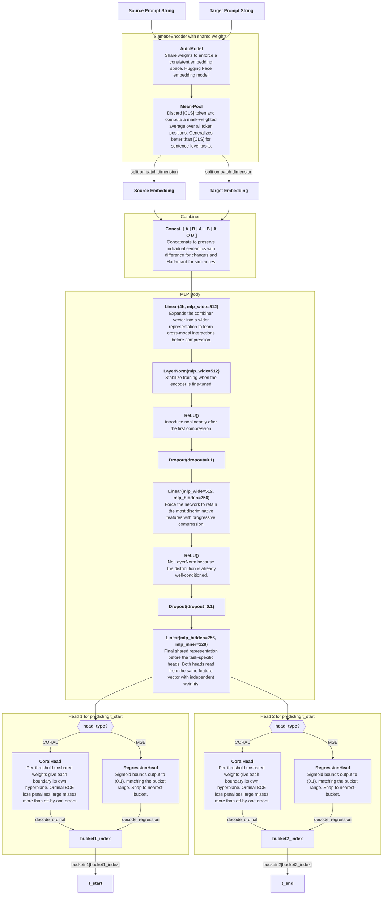

# Classification Model Architecture

## Shapes at a glance

| Stage | Output shape | Notes |
|---|---|---|
| SiameseEncoder | `(2N, h)` | both strings in one batched call |
| emb_A, emb_B | `(N, h)` | split on batch dim |
| Combiner | `(N, 4h)` | concat + diff + Hadamard |
| MLP Body | `(N, mlp_inner)` | three Linear layers |
| CoralHead logits | `(N, K−1)` | K = number of buckets |
| RegressionHead output | `(N,)` | sigmoid-bounded scalar |
| Bucket indices | `(N,)` | decoded from either head |
| Final prediction | `(N,)` each | looked up from buckets1 / buckets2 |

## Loss functions (training only)

| Head type | Loss | File |
|---|---|---|
| CORAL | `ordinal_loss` — binary CE over K−1 cumulative threshold targets | [head_coral.py](head_coral.py) |
| MSE | `regression_loss` — MSE between sigmoid output and true bucket value | [head_mse.py](head_mse.py) |

## Evaluation metric

`mae_buckets` ([head_mae.py](head_mae.py)) — Mean Absolute Error over bucket indices. An MAE of 1.0 = off by one bucket on average.
