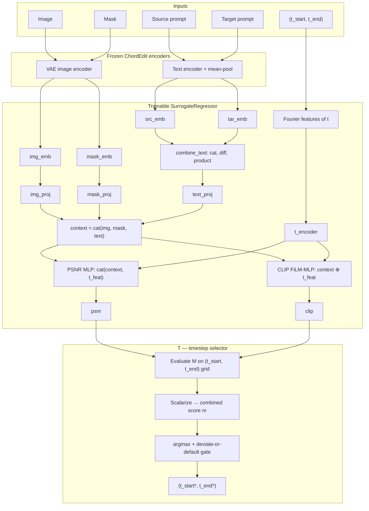

# Modified Classification (M + T)

Metric surrogate **M** predicts `(psnr, clip)` from image/prompt embeddings and `(t_start, t_end)`. Timestep selector **T** uses M to pick the best grid cell (no extra trainable weights).

Every tunable lives in `settings.json`; `settings.py` reads it and derives paths
and column names from it (see [Configuration](#configuration)).

## Architecture



**M** bottlenecks image/mask/text embeddings, encodes timesteps with Fourier features, then predicts via separate towers: a standard MLP for PSNR (timesteps concatenated) and a FiLM-conditioned MLP for CLIP (timesteps as modulation). **T** has no trainable weights — it queries M over the discrete grid and selects the best cell.

## Setup

```bash
conda activate chordedit
cd models/modified-classification
```

Requires ChordEdit weights at `CHORD_EDIT_MODEL_ROOT` for the selected `CHORD_EDIT_MODEL` (see `settings.py`).

## Metric surrogate, M

### 0. Cache embeddings (optional)

Pack scattered per-sample embedding `.pt` files into a packed table at `.cache/packed_embeddings/`:

```bash
python train_m.py --skip-model  # CPU-only; builds the caches, then exits.
```

Encoder behavior always matches the ChordEdit model type: for `sd` models the stored text sequences are collapsed with the same mask-weighted mean pooling as encoding (tokenizer-only, no weights); `sdxl` scattered files must already store `text_encoder_2` pooled embeds; `flux` raises `NotImplementedError`. Each packed cache carries a `meta` dict (model, pipeline type, pooling, dims, provenance) — a cache whose meta is missing or does not match the current settings is treated as a miss and repacked.

Later `train_m` / eval reuse the packed cache. Encoders are inherited from the ChordEdit pipeline and are never trainable; if no cache can satisfy a request, `embeddings.get_embeddings` falls back to encoding on the fly with the frozen encoders (and raises if the caller provides no encoder-bearing predictor).

### 1. Train

```bash
python train_m.py
```

Writes a run to `outputs/<dataset>/` (named by `RUN_NAME`, else a timestamp) with `regressor_weights.pt`, the `settings.json` it used, and train/val/test splits.

### 2. Evaluate

Open and run all cells in `eval_m.ipynb`. Set `CUDA_VISIBLE_DEVICES` in the setup cell to pick the GPU. The notebook loads the latest run (or set `RUN_DIR`) and uses that run's saved `settings.json` for paths/hyperparameters. It reports prediction error, calibration, and grid-surface fidelity.

### Timestep selector, T

Run after M training completes.

### 1. Evaluate selection metrics

```bash
python train_t.py
# optional: python train_t.py --run-dir outputs/UltraEdit_Region_100/<timestamp> --gpu 1
```

Reports regret, Spearman correlation, and deviate-gate precision/recall on the test split. Saves `t_train_metrics.json`, `t_test_selections.json`, and
`id_to_predictions_<commit>.csv` (`sample_id`, `pred_t_start`, `pred_t_end`) tagged with the commit that produced it.

### 2. Visualize

Open and run all cells in `eval_t.ipynb` for selection diagnostics and plots.

## Configuration

`settings.json` holds every tunable. `settings.py` reads it once at import and
derives the fixed structure - paths, column names, the phi partials - from
those values. To run a different configuration, edit `settings.json` or pass
`--settings-path` pointing at another copy:

```bash
CUDA_VISIBLE_DEVICES=4 python train_m.py --settings-path /tmp/my_config.json
```

Every run saves the config it used to `<run_dir>/settings.json`, and
`train_t.py` (and the analysis scripts) replay a run from that snapshot when
given `--run-dir` - so evaluation always sees the training config, whatever
`--settings-path` says. A key missing from the file is an error, not a silent
default.

`settings.py` binds its constants at import time, before any script's argparse
runs, so it reads `--settings-path` straight off `sys.argv`; the entry points
declare the flag as well so it appears in `--help`.

Settings added on top of the original hyperparameters:

| Setting | Default | Purpose |
| --------- | --------- | --------- |
| `CKPT_METRIC` | `val_phi_spearman` | Best-epoch criterion: `val_phi_spearman`, `val_regret` or `val_loss` |
| `GRIDS_PER_BATCH` | 32 | Sample grids per training batch; 32 is ~250x faster than 1 on Region_10000 |
| `USE_CELL_ANCHOR` | `True` | Predict deviation from the train split's mean surface |
| `PSNR_LOSS_WEIGHT` / `CLIP_LOSS_WEIGHT` | 1.0 | Per-target weights on the z-scored MSE |
| `RANKING_TOP_K` | 0 | Restrict the ranking loss to pairs whose better cell is in the true top k (hurts - see SUMMARY) |
| `LR_SCHEDULER` | `cosine` | `cosine` or `none` |
| `EARLY_STOP_PATIENCE` | 0 | Stop after this many epochs without improvement (0 = off) |
| `EMA_DECAY` | 0.0 | Evaluate and checkpoint an EMA of the weights |
| `IMG_ENCODER` | `linear` | `conv` folds the VAE latent back to (C, S, S) and downsamples |
| `SPLIT_SEED` | 42 | Split seed, separate from `SEED` so init can be reseeded without moving samples between splits |
| `T_TARGET_FN` | `linex` | Scalar objective phi: `naive`, `cara` or `linex` |
| `PHI_ALPHA` | 2.0 | Curvature for `cara` / `linex`; ignored by `naive` |
| `DEFAULT_T_START` / `DEFAULT_T_END` | 0.9 / 0.3 | Baseline cell phi is measured against |
| `RUN_NAME` | `""` | Run directory name (default: timestamp) |
