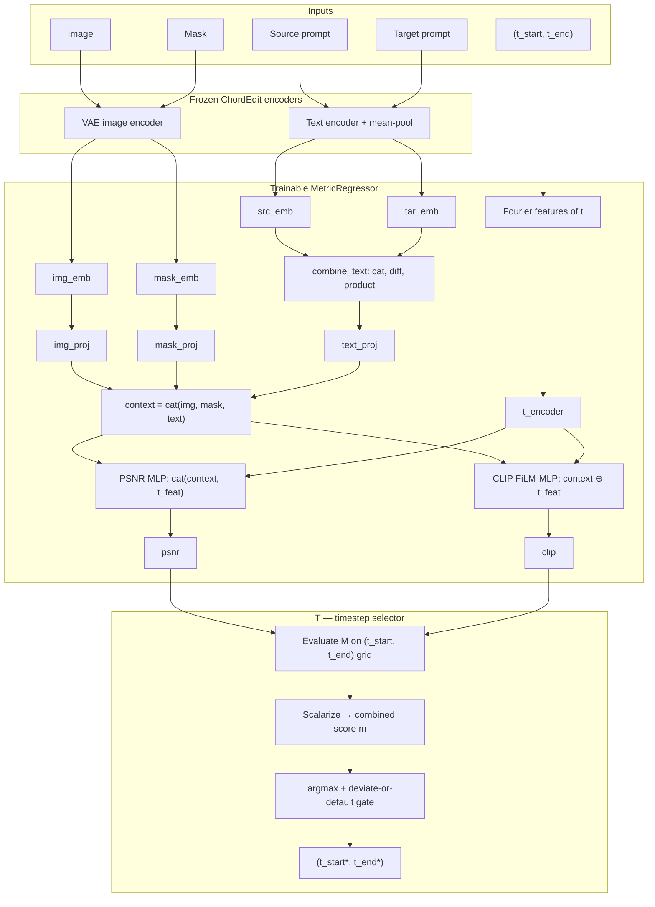

# Modified Classification (M + T)

Metric surrogate **M** predicts `(psnr, clip)` from image/prompt embeddings and `(t_start, t_end)`. Timestep selector **T** uses M to pick the best grid cell (no extra trainable weights).

Configure data paths and hyperparameters in `settings.py` before running.

## Architecture



**M** bottlenecks image/mask/text embeddings, encodes timesteps with Fourier features, then predicts via separate towers: a standard MLP for PSNR (timesteps concatenated) and a FiLM-conditioned MLP for CLIP (timesteps as modulation). **T** has no trainable weights — it queries M over the discrete grid and selects the best cell.

## Setup

```bash
conda activate chordedit
cd models/modified-classification
```

Requires SD-Turbo weights at `SD_TURBO_ROOT` (see repo root `README.md`).

## M — metric surrogate

**1. Train**

```bash
python train_m.py
```

Writes a timestamped run to `outputs/<dataset>/`, including `regressor_weights.pt`, a copy of `settings.py`, and train/val/test splits.

**2. Evaluate**

Open and run all cells in `eval_m.ipynb`. Set `CUDA_VISIBLE_DEVICES` in the setup cell to pick the GPU. The notebook loads the latest run (or set `RUN_DIR`) and uses that run's saved `settings.py` for paths/hyperparameters. It reports prediction error, calibration, and grid-surface fidelity.

## T — timestep selector

Run after M training completes.

**1. Evaluate selection metrics**

```bash
python train_t.py
# optional: python train_t.py --run-dir outputs/UltraEdit_Region_100/<timestamp> --gpu 1
```

Reports regret, Spearman correlation, and deviate-gate precision/recall on the test split. Saves `t_train_metrics.json` and `t_test_selections.json`.

**2. Visualize**

Open and run all cells in `eval_t.ipynb` for selection diagnostics and plots.

## Shared modules

| File | Role |
|------|------|
| `model_t.py` | T selection, scalarization, and eval metrics (regret, Spearman, gate) |
| `_helpers.py` | Shared helpers: run settings save/load, pooling, normalization, ranking loss |
